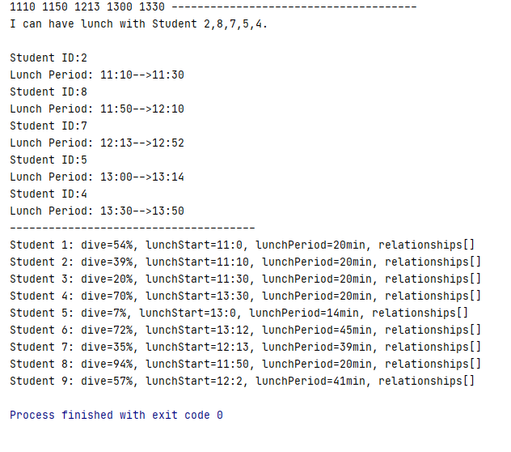
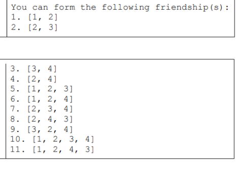

## E3

**Test Code**

```java
public static void main(String[] args) {
        ArrayList<Student> s = new ArrayList<>();

        for (int i = 0; i < 9; i++) {
            s.add(new Student());
        }

        s.get(0).setLunchStart(1100);
        s.get(0).setLunchPeriod(20);

        s.get(1).setLunchStart(1110);
        s.get(1).setLunchPeriod(20);

        s.get(2).setLunchStart(1130);
        s.get(2).setLunchPeriod(20);

        s.get(3).setLunchStart(1330);
        s.get(3).setLunchPeriod(20);

        s.get(7).setLunchStart(1150);
        s.get(7).setLunchPeriod(20);

        E3Lunch e= new E3Lunch(s);
        ArrayList<Student> ans = e.receiver(s.get(0));
        for (Student an : ans) System.out.print(an.getLunchStart() + " ");
        System.out.println(e.getLunchList(ans));

        Student.printStudents(s);

    }
```



**<u>Bug**: 11:30-11:50 not found</u>


## E6

<u>Can you rearrange the output by its length and return a String like this?</u>

